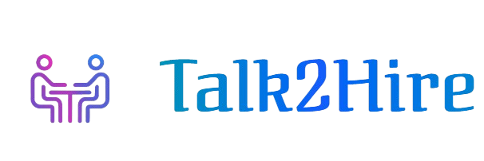

   # Talk2Hire – AI‑Powered Recruiter App 🤖💼

<div align="center">


<br/>

<br/><br/>
<strong>Revolutionizing Recruitment with AI‑Powered Interviews</strong>

</div>

---

## 🌐 Live Demo

🚀 **Frontend (Vercel):**
[https://talk2-hire-ai-powered-recruiter-app-nine.vercel.app/](https://talk2-hire-ai-powered-recruiter-app-nine.vercel.app/)

> Use this link to experience the full AI-powered interview flow with avatars, resume analysis, and real-time evaluation.

---

## ✨ Overview

**Talk2Hire** is a cutting‑edge, full‑stack recruitment platform that automates the entire interview process using advanced AI technologies. It combines **AI avatars**, **real‑time interviews**, **resume intelligence**, and **automated evaluation** into a single modern recruitment ecosystem.

> 🎓 **Academic Project**: Bachelor of Technology (Hons) in Computer Science and Engineering, **GLA University**

---

## 🚀 Key Features

### 🎯 Core Functionality

* 🤖 **AI‑Powered Interviews** – Conversational interviews with intelligent AI agents
* 👤 **Interactive AI Avatars** – 3D animated avatars using Three.js & ReadyPlayerMe
* 📄 **Smart Resume Analysis** – Automatic skill, experience & qualification extraction
* 📊 **Real‑time Evaluation** – Instant feedback and scoring
* 🔗 **Multi‑Platform Sharing** – Share interviews via Email, WhatsApp, or links

### 👨‍💼 Admin Portal

* 📅 **Interview Scheduling** – Create & manage interviews
* 👥 **Candidate Management** – Track candidates & performance
* 📈 **Analytics Dashboard** – Interactive charts & insights
* ✉️ **Automated Invitations** – Email‑based interview invites
* 🔐 **Secure Authentication** – Google OAuth with role‑based access

### 👤 Candidate Experience

* 💬 **Chat‑Style Interface** – WhatsApp‑like UI
* 🎤 **Dual Interview Modes** – Video (AI Avatar) & Audio‑only
* 📱 **Mobile Responsive** – Works across all devices
* 📋 **Resume Upload** – PDF / DOCX / TXT support
* 📝 **Instant Feedback** – Performance insights after interview

---

## 🏗️ System Architecture

```
Frontend (Next.js 15)
 ├── React 19
 ├── TypeScript
 ├── Tailwind CSS
 ├── ShadCN UI
 └── Three.js (AI Avatars)

Backend (Python Flask)
 ├── Resume Parser
 ├── Groq LLM (LLaMA‑3)
 ├── AssemblyAI (Speech)
 └── Email API

Database & Auth (Supabase)
 ├── PostgreSQL
 ├── Google OAuth
 ├── Storage
 └── Realtime Updates
```

---

## 🛠️ Technology Stack

### Frontend

<p align="left">


</p>

### Backend & AI

<p align="left">


</p>

### Database & Infrastructure

<p align="left">


</p>

---

## 📁 Project Structure

```
Talk2Hire---AI-Powered-Recruiter-App/
├── src/app/            # Next.js App Router
├── backend/            # Flask backend
├── services/           # Business logic
├── public/             # Static assets & 3D models
├── components/         # UI components
├── hooks/              # Custom hooks
├── utils/              # Helpers
└── README.md
```

---

## 🚀 Getting Started

### Prerequisites

* Node.js 18+
* Python 3.12+
* Supabase account
* Groq API key
* Google OAuth credentials

### Installation

```bash
git clone https://github.com/yourusername/Talk2Hire---AI-Powered-Recruiter-App.git
cd Talk2Hire---AI-Powered-Recruiter-App
```

#### Frontend

```bash
npm install
npm run dev
```

#### Backend

```bash
cd backend
pip install -r requirements.txt
python app.py
```

---

## 🚀 Deployment

### Frontend – Vercel

* Import GitHub repo
* Add env variables
* Deploy 🚀

### Backend – Render

* Root: `backend`
* Build: `pip install -r requirements.txt`
* Start: `python app.py`

---

## 📄 License

This project is licensed under the **MIT License**.

---

<div align="center">
<strong>Built with ❤️ for the future of recruitment</strong>
<br/><br/>
© 2026 Talk2Hire – AI Powered Recruiter App
</div>
